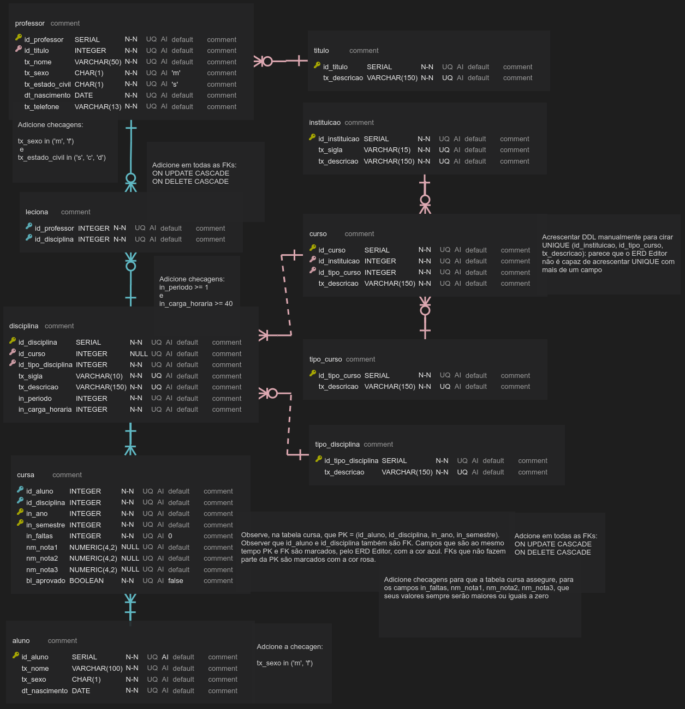
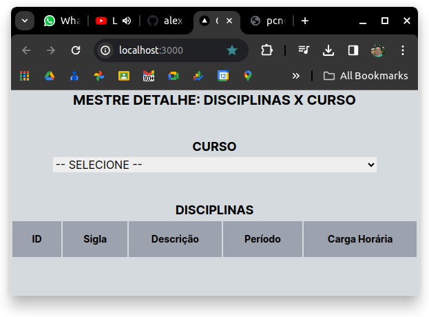

# Exercício acerca de esquema mestre detalhe de dados

Esse exercício deve considerar o clone do código público disponibilizado no repositório [https://github.com/alexpaulooliveira/nextjs_exerc__master_detail__start_point](https://github.com/alexpaulooliveira/nextjs_exerc__master_detail__start_point) como ponto de partida. 

### Como baixar, configurar, e executar a aplicação:

Estando na pasta à partir da qual você deseja que a aplicação seja criada, execute o seguinte comando:

```
git clone <endereço do repositório>
```

Depois, instale as bibliotecas listadas no package.json, fazendo uso do seguinte comando:

```
npm install
```

Por fim, execute a aplicação fazendo uso do seguinte comando:


```
npm run dev
```

## Objetivos do exercício:

### 1) Ajustar o *backend* (*API REST*), disponibilizando um *endpoint* que retorne todos os cursos disponíveis na base, e outro que receba o código do curso (na própria URL) e retorne um *JSON* com todas as disciplinas que estão vinculadas ao curso parametrizado. Caso não tenha tido tempo de desenvolver sua *API REST*, pode utilizar os seguintes *endpoints*:. 


[https://pcn662vet2.execute-api.us-east-1.amazonaws.com/dev/curso](https://pcn662vet2.execute-api.us-east-1.amazonaws.com/dev/curso)

[https://pcn662vet2.execute-api.us-east-1.amazonaws.com/dev/disciplinas_por_curso/](https://pcn662vet2.execute-api.us-east-1.amazonaws.com/dev/disciplinas_por_curso/1)
(este último precisa ser concatenado com o id do curso)

Considere o *ERD* visto na imagem abaixo para programar a *API REST* que atenderá às necessidades do exercício em pauta:



### 2) Crie um combo que carregue a lista de todos os cursos que existem na base de dados. A primeira opção do combo será acrescentada manualmente, e será o texto "-- SELECIONE --". As demais opções deverão ser carregadas por meio da *API REST*, ajustada na questão anterior. Enquanto nenhum curso for selecionado, o sistema deve se comportar de maneira similar ao que pode ser visualizado no *screen shot* abaixo:




### 3) O combo criado na questão anterior representa o seletor do *registro mestre*. Quando um curso for selecionado, suas disciplinas (*registros detalhe*) devem ser listadas em um grid, conforme imagem seguinte:

